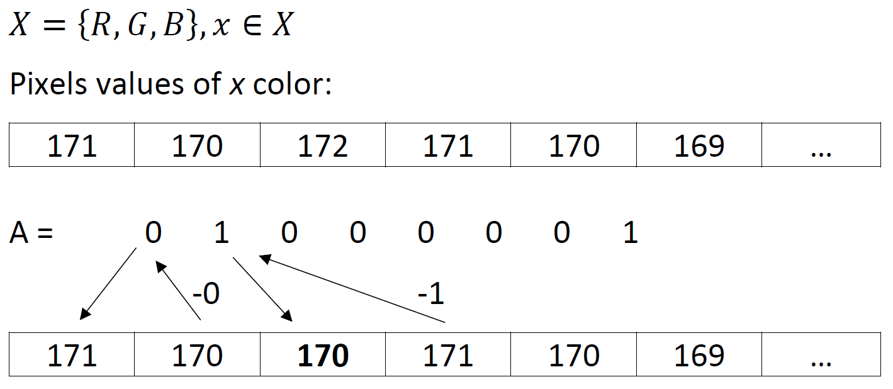

# Image-Cipher
Steganography software for encrypting text into image that uses modified version of LSB (Least Significant Bit) algorithm.

## Usage:
### Window option
1. Find a photo to use for encryption.
2. Enter the name of that photo in place of "image_name".
3. Enter text to encrypt.
4. Click "Encrypt".
5. Enjoy!

#### To decrypt text from image:
1. Enter name of image with encrypted message.
2. Click "Decrypt".
3. Enjoy!

### Command line arguments:
`-EM arg` or `--encryption-mode arg` - sets encryption mode to one of the following: 
* if `arg` is equal to 1, then SingleColorEncryption will be used
* if `arg` is equal to 2, then MultiColorEncryptio will be used
* if `arg` is equal to 3, then LowLevelBitEncryption will be used
* if `arg` is equal to 4, then RSAEncryption will be used. WARNING: EXPERIMENTAL IMPLEMENTATION

`-DM arg` or `--decryption-mode arg` - sets decryption mode with `arg` option analogically used as above (of course it will decrypt specific algorithm)

`-f fileName` or `--file-name fileName` - sets image name (or path to it) which will store encrypted data

#### Example:
`java -jar Image-Cipher.jar -DM 3 -f my_awesome_image_with_embedded_data.file`

### Before encryption

### After encryption

### How does it work?

### Error codes:
1 - IOException

2 - Invalid arguments (for example encrypting and decrypting at the same time)

### Documentation is available on: [JavaDoc](https://skocur.github.io/Image-Cipher/)
